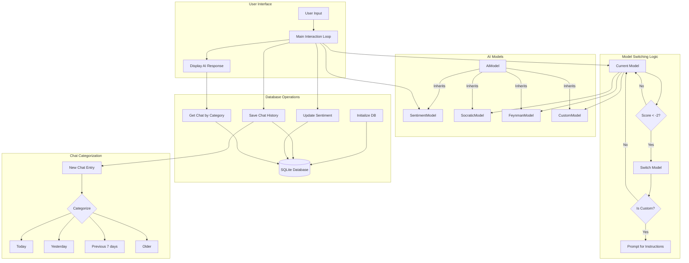

# WeCode-Ai-Learning-Assistant

# GENAI powered teaching assistant

An AI-based tool designed to help users learn complex topics such as Data Structures and Algorithms (DSA). The assistant primarily utilizes the Socratic method of questioning but also includes alternative learning techniques. These techniques can be customized by the user to suit their learning style.
The Model can dynamically understand the expertise level of the user of a given topic and the model can change the perception of the user if they explicitly say so. the default learning technique is socratic method.There is 1 more additonal learning method which the user can choose from which is Feynman Technique .Also most importantly the user can define and create a custom learning or teaching method of their own.The user

---
Complete System Architecture




## Features

- Multiple Learning Methods:
    - Socratic Method
    - Feynman Technique
    - User-defined custom learning methods
- Dynamic User Expertise Level:
    - The model can gauge the user’s expertise level and adjust its responses accordingly.
- User Interaction:
    - Users can choose their preferred teaching methods and create their own.


## Learning Techniques

- Socratic Method: Engages users by asking guided questions to deepen understanding.
- Feynman Technique: Simplifies complex ideas to basic concepts, ensuring full comprehension.
- Customizable Methods: Users can design their own teaching methods tailored to their learning style.
## AI Model Architecture

The system relies on a multi-layered model structure that adapts its responses dynamically


---
visualizes the interaction between users and the AI models in a more emotionally resonant and intuitive way.
## Technical Implementation

The diagram represents a sentiment-driven, adaptive multi-model AI system. Sentiment analysis is performed on each user interaction using a dedicated SentimentModel, quantifying emotional context. A cumulative scoring mechanism (-1 for negative, 0 for neutral, +1 for positive) triggers model switching when the score falls below -2. The system employs three distinct models (Socratic, Feynman, and Custom) with inheritance from a base AiModel class, each implementing unique response generation strategies. The Custom model, when activated, allows for dynamic system instruction updates, enhancing adaptability. This architecture enables continuous learning and optimization based on user interactions and feedback.

```mermaid
%%{init: {'theme': 'dark', 'themeVariables': { 'darkMode': true }}}%%
graph TD
    subgraph "AI Models' Emotional Journey"
        A[Start: Socratic Model] -->|User Interaction| B{Sentiment Analysis}
        B -->|Positive| C[["😊 +1 Score"]]
        B -->|Neutral| D[["😐 No Change"]]
        B -->|Negative| E[["😢 -1 Score"]]
        
        C --> F{Score Check}
        D --> F
        E --> F
        
        F -->|Score >= -2| G[["🧠 Continue Learning"]]
        F -->|Score < -2| H[["😰 Struggle"]]
        
        H -->|Switch Model| I[Feynman Model]
        I --> J[["🔄 Reset Score"]]
        J --> |User Interaction| B
        
        I -->|Multiple Struggles| K[Custom Model]
        K -->|User Accepts| L[["🎨 Customization"]]
        K -->|User Declines| M[["↩️ Return to Socratic"]]
        
        L --> |User Interaction| B
        M --> A
        
        G -->|Continuous Learning| N[["🌟 AI Growth"]]
        N -->|New Challenges| B
    end

    classDef default fill:#2a2a2a,stroke:#7a7a7a,color:#e0e0e0;
    classDef model fill:#4a4a8c,stroke:#7a7aff,color:#ffffff,stroke-width:2px;
    classDef positive fill:#2d6a4f,stroke:#40916c,color:#ffffff;
    classDef neutral fill:#7d6608,stroke:#b7921e,color:#ffffff;
    classDef negative fill:#991b1b,stroke:#dc2626,color:#ffffff;
    classDef action fill:#374151,stroke:#6b7280,color:#ffffff;
    
    class A,I,K model;
    class C positive;
    class D neutral;
    class E negative;
    class G,L,N positive;
    class H negative;
    class B,F,J,M action;
```




---
Code Flow


### Frameworks and Libraries

Additional frameworks and libraries used in this project:

* 

* 


---
Chat History Database Flow


## Installation

1.Clone the repository:

```bash
git clone https://github.com/sky0walker99/WeCode-Ai-Learning.git

```
2.Navigate to the project directory and install dependencies:

```bash
cd WeCode-Ai-Learning
pip install -r requirements.txt

```
3.Run the project
```bash

python main.py

```
    
## Environment Variables

To run this project, you will need to add the following environment variables to your .env file

`API_KEY` : https://aistudio.google.com/app/apikey


## 🚀 About Me
This is a collaborative project developed by a team of four passionate individuals:

- ALEN SUNNY       – AI/ML Specialist, responsible for the AI model architecture 
- MUHAMMED HAROON  – AI/ML Specialist, responsible for the AI model architecture and core features
- Muhammed Shahbas – AI/ML Specialist, responsible for the AI model architecture and database integration
- MALIK DINAR A S  – FullStack Developer, focused on the user interface and experience and server-side logic.


Our goal is to create an innovative and interactive platform for teaching complex topics like Data Structures and Algorithms using cutting-edge AI technology.


## 🔗 Links
- AlenSuny :[](https://github.com/Alen-121) 
[](https://www.linkedin.com/in/alen--sunny/)
- Muhammed Haroon :[](https://github.com/sky0walker99/) 
[](https://www.linkedin.com/in/muhammed-haroon-0399962b8/)
- Malik Dinar A S :[](https://github.com/malik-dinar) 
[](https://www.linkedin.com/in/malik-dinar-510795234/)
- Muhammed Shanz :[](https://github.com/Alen-121)
[]([https://www.linkedin.com/](https://www.linkedin.com/in/alen--sunny/))


