# WeCode-Ai-Learning-Assistant

 **GENAI powered teaching assistant**

WeCode-Ai-Learning-Assistant is an AI-based tool designed to enhance users' learning experience in complex subjects like Data Structures and Algorithms (DSA). By utilizing dynamic teaching methodologies, including the Socratic method and Feynman technique, the assistant can be customized to fit the learner’s individual style. The system intelligently adapts to the user’s expertise level, ensuring an engaging and effective learning journey.

## Features

- Multiple Learning Methods:
    - Socratic Method
    - Feynman Technique
    - User-defined custom learning methods
- Dynamic User Expertise Level:
    - The AI gauges the user's proficiency level and adapts its explanations and difficulty accordingly.
- User Interaction:
    - Users can choose their preferred teaching methods and create their own.


### Learning Techniques

- Socratic Method: Engages learners through probing questions that challenge them to think critically and discover answers on their own.
- Feynman Technique:  Forces learners to explain concepts in simple terms, ensuring mastery of the subject matter.
- Customizable Methods: Offers flexibility for users to craft their own teaching strategies, adapting the assistant to personal preferences and needs.
## AI Model Architectures

The system relies on a multi-layered model structure that adapts its responses dynamically


 **Technical Implementation**

The diagram represents a sentiment-driven, adaptive multi-model AI system. Sentiment analysis is performed on each user interaction using a dedicated SentimentModel, quantifying emotional context. A cumulative scoring mechanism (-1 for negative, 0 for neutral, +1 for positive) triggers model switching when the score falls below -2. The system employs three distinct models (Socratic, Feynman, and Custom) with inheritance from a base AiModel class, each implementing unique response generation strategies. The Custom model, when activated, allows for dynamic system instruction updates, enhancing adaptability. This architecture enables continuous learning and optimization based on user interactions and feedback.

```mermaid
%%{init: {'theme': 'dark', 'themeVariables': { 'darkMode': true }}}%%
graph TD
    subgraph "AI Models' Emotional Journey"
        A[Start: Socratic Model] -->|User Interaction| B{Sentiment Analysis}
        B -->|Positive| C[["😊 +1 Score"]]
        B -->|Neutral| D[["😐 No Change"]]
        B -->|Negative| E[["😢 -1 Score"]]
        
        C --> F{Score Check}
        D --> F
        E --> F
        
        F -->|Score >= -2| G[["🧠 Continue Learning"]]
        F -->|Score < -2| H[["😰 Struggle"]]
        
        H -->|Switch Model| I[Feynman Model]
        I --> J[["🔄 Reset Score"]]
        J --> |User Interaction| B
        
        I -->|Multiple Struggles| K[Custom Model]
        K -->|User Accepts| L[["🎨 Customization"]]
        K -->|User Declines| M[["↩️ Return to Socratic"]]
        
        L --> |User Interaction| B
        M --> A
        
        G -->|Continuous Learning| N[["🌟 AI Growth"]]
        N -->|New Challenges| B
    end

    classDef default fill:#2a2a2a,stroke:#7a7a7a,color:#e0e0e0;
    classDef model fill:#4a4a8c,stroke:#7a7aff,color:#ffffff,stroke-width:2px;
    classDef positive fill:#2d6a4f,stroke:#40916c,color:#ffffff;
    classDef neutral fill:#7d6608,stroke:#b7921e,color:#ffffff;
    classDef negative fill:#991b1b,stroke:#dc2626,color:#ffffff;
    classDef action fill:#374151,stroke:#6b7280,color:#ffffff;
    
    class A,I,K model;
    class C positive;
    class D neutral;
    class E negative;
    class G,L,N positive;
    class H negative;
    class B,F,J,M action;
```




---
**Code Flow**


---
**Chat History Database Flow**


---


### Frameworks and Libraries

Additional frameworks and libraries used in this project:

* 

* 

### Installation

1.Clone the repository:

```bash
git clone https://github.com/sky0walker99/WeCode-Ai-Learning.git

```
2.Navigate to the project directory and install dependencies :

```bash
cd WeCode-Ai-Learning
pip install -r requirements.txt

```
3.Install React frontend dependencies: :

```bash
cd frontend
npm install
```
4.Run the project
```bash

python main.py

```
5.Run the React frontend
```bash

cd frontend
npm start

```
    
## Environment Variables

To run this project, you will need to add the following environment variables to your .env file

`API_KEY` : https://aistudio.google.com/app/apikey


## 🚀 About Me
This is a collaborative project developed by a team of four passionate individuals:

- ALEN SUNNY       – AI/ML Specialist, responsible for the AI model architecture 
- MUHAMMED HAROON  – AI/ML Specialist, responsible for the AI model architecture and core features
- Muhammed Shahbas – AI/ML Specialist, responsible for the AI model architecture and database integration
- MALIK DINAR A S  – FullStack Developer, focused on the user interface and experience and server-side logic.

Our goal is to create an innovative and interactive platform for teaching complex topics like Data Structures and Algorithms using cutting-edge AI technology.


## 🔗 Links
- AlenSuny :[](https://github.com/Alen-121) 
[](https://www.linkedin.com/in/alen--sunny/)
- Muhammed Haroon :[](https://github.com/sky0walker99/) 
[](https://www.linkedin.com/in/muhammed-haroon-0399962b8/)
- Malik Dinar A S :[](https://github.com/malik-dinar) 
[](https://www.linkedin.com/in/malik-dinar-510795234/)
- Muhammed Shanz :[](https://github.com/Blaacknight)
[](https://www.linkedin.com/in/shahbas-v-s-7055ab2a9/)


